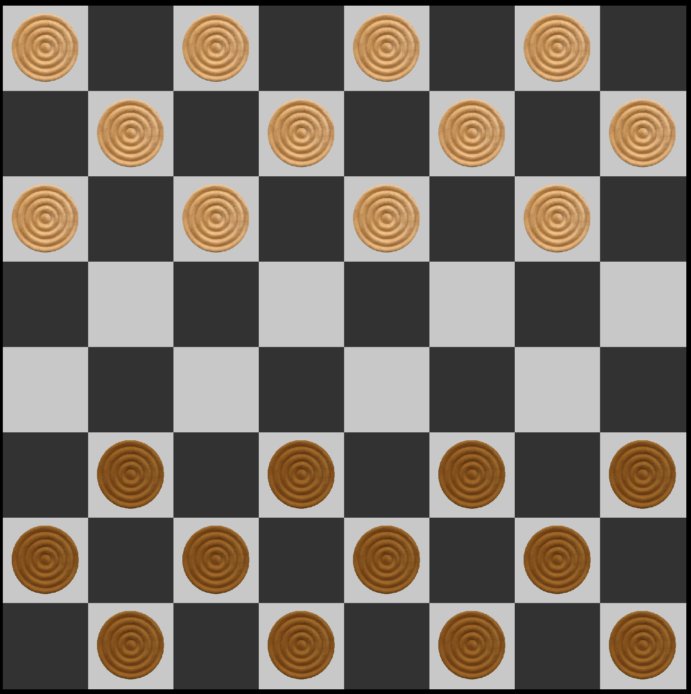
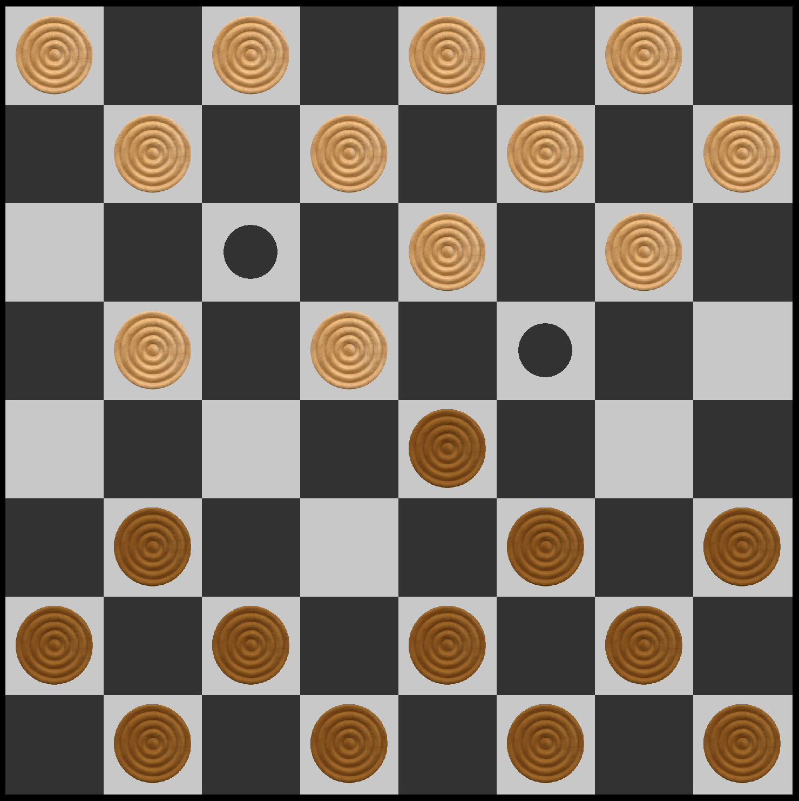

# Шашки
## Цель
Создать цифровую реализацию классической игры "шашки" с использованием библиотеки 2D-графики "SFML"

## Краткое описание
Классическая игра "шашки" для двоих игроков!

## Запуск
Для запуска игры необходимо установить на компьютер графическую библиотеку и скомпилировать проект с помощью CMake
## Управление
Управление осуществляется при помощи мыши нажатиями на шашки, а затем нажатием на иконки контекстуальных подсказок для перемещения шашек

## Ссылки на источники
#### Библиотека SFML
https://www.sfml-dev.org
#### Статья с примером реализации игры
https://ravesli.com/uroki-po-sfml/
